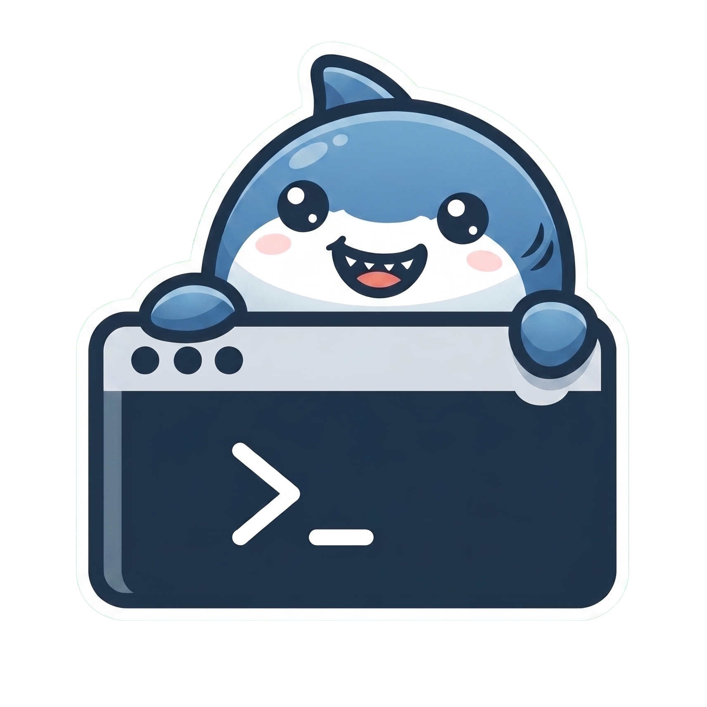

#  Megalodon

Deploy applications to cloud platforms with a single command. megalodon handles cloning your source code, running the build pipeline, and shipping the artifact to the cloud — no manual steps.

```
meg 
```

---

## Supported Platforms

| Dimension | Supported |
|-----------|-----------|
| **App types** | React, Node.js, Docker, Custom script |
| **Cloud platforms** | AWS (S3/EC2), GCP, Azure, Lambda |
| **VCS providers** | GitHub, GitLab |
| **Executors** | Local, Jenkins |

---

## Prerequisites

- [Bun](https://bun.sh) v1.0 or later
- Node.js 20+ (fallback if Bun is unavailable)
- Git

### Install Bun

```bash
curl -fsSL https://bun.sh/install | bash
```

---

## Installation

### Option 1 — Run from source

```bash
git clone https://github.com/your-org/megalodon.git
cd megalodon
bun install
```

Run directly:

```bash
bun run src/index.ts deploy
```

### Option 2 — Build a single binary

#### For your current platform only

```bash
bun run build
```

Produces a signed, ready-to-run `./meg` binary in the project root.

Move it somewhere on your `$PATH`:

```bash
mv meg /usr/local/bin/meg
```

Then use it from anywhere:

```bash
meg 
```

#### For all platforms (distribution)

```bash
bun run build:all
```

Produces binaries for every platform under `dist/`:

```
dist/
  macos-arm64/meg
  macos-x64/meg
  linux-arm64/meg
  linux-x64/meg
  windows-x64/meg.exe
```

macOS binaries are automatically ad-hoc signed so Gatekeeper doesn't block them. Linux and Windows binaries require no signing. Ship the folder matching the customer's platform.

#### Releasing a new version

1. Bump the version in `package.json`:

```json
{
  "version": "1.2.0"
}
```

2. Rebuild the binaries:

```bash
bun run build:all
```

The version is read directly from `package.json` at build time — no other files need updating. Verify with:

```bash
./dist/macos-arm64/meg --version
```

---

## Configuration

Copy the example config and fill in your values:

```bash
cp megalodon.example.yml megalodon.yml
```

`megalodon.yml`:

```yaml
project:
  type: react                      # react | node | docker | custom
  build:
    # script: "npm run build:prod" # optional — overrides default build steps
    outputDir: dist                # optional — defaults per project type

target:
  platform: aws                    # aws | gcp | azure | lambda
  region: us-east-1
  environment: production
  resourceId: my-s3-bucket-name    # S3 bucket, instance ID, function name, etc.

vcs:
  provider: github                 # github | gitlab
  repoUrl: "https://github.com/your-org/your-repo"
  branch: main

executor:
  type: local                      # local | jenkins
```

> **Credentials are never stored in `megalodon.yml`.** Set them as environment variables (see below).

---

## Credentials

### GitHub / GitLab

```bash
export megalodon_VCS_TOKEN=ghp_your_token_here
```

### AWS

```bash
export AWS_ACCESS_KEY_ID=AKIA...
export AWS_SECRET_ACCESS_KEY=...
export AWS_SESSION_TOKEN=...       # optional, for temporary credentials
```

### GCP

```bash
export GOOGLE_APPLICATION_CREDENTIALS=/path/to/service-account.json
```

### Azure

```bash
export AZURE_CLIENT_ID=...
export AZURE_CLIENT_SECRET=...
export AZURE_TENANT_ID=...
export AZURE_SUBSCRIPTION_ID=...
```

---

## Usage

### Deploy

```bash
meg 
```

Options:

```
-c, --config <path>       Path to megalodon.yml (default: ./megalodon.yml)
-i, --interactive         Launch interactive setup wizard (no config file needed)
-t, --target <platform>   Override target platform (aws|gcp|azure|lambda)
-e, --env <name>          Override environment name
    --dry-run             Validate config and credentials without deploying
    --json                Emit newline-delimited JSON events (for CI/scripting)
-v, --verbose             Show full step output
```

Examples:

```bash
# Deploy using default config
meg 

# Interactive wizard — no megalodon.yml needed
meg  --interactive

# Interactive wizard + dry-run (validate credentials without deploying)
meg  --interactive --dry-run

# Interactive wizard — no megalodon.yml needed
meg  --interactive

# Interactive wizard + dry-run (validate credentials without deploying)
meg  --interactive --dry-run

# Override platform at runtime
meg  --target lambda

# Validate only — no deploy
meg  --dry-run

# Use a custom config path
meg  --config ./config/prod.yml

# JSON output for CI pipelines
meg  --json
```

### Docker EC2 Deployment

Deploy a single Docker image directly to an EC2 instance — no VCS token required. You point megalodon at a Dockerfile; it ships the file to EC2, builds the image there, and starts the container on port 80.

**Pipeline** (runs on every `meg deploy` invocation):

```
Copy Dockerfile locally → Transfer to EC2 → Install Docker (if absent) → Build image on EC2 → Free port 80 → Start container
```

Re-running the command always gets the latest code (build runs with `--no-cache`) and replaces the existing container automatically.

#### 1. Write your Dockerfile

All git cloning and build logic lives inside your Dockerfile — megalodon just ships it. A typical React app Dockerfile looks like:

```dockerfile
FROM node:20-alpine AS builder
RUN apk add --no-cache git
ARG GIT_REPO_URL=https://github.com/your-org/your-react-app.git
ARG GIT_BRANCH=main
WORKDIR /app
RUN git clone --depth 1 --branch ${GIT_BRANCH} ${GIT_REPO_URL} .
RUN npm ci && npm run build

FROM nginx:1.27-alpine
COPY --from=builder /app/out /usr/share/nginx/html
EXPOSE 80
CMD ["nginx", "-g", "daemon off;"]
```

#### 2. Configure `megalodon.yml`

Only the `target` section is required — no `vcs` section needed for Docker deployments:

```yaml
project:
  type: docker
  build:
    dockerfilePath: ./Dockerfile   # relative to this file, or use --dockerfile flag

target:
  platform: aws
  region: us-east-1
  environment: production
  resourceId: i-0123456789abcdef0  # your EC2 instance ID
```

#### 3. Set environment variables

```bash
export AWS_ACCESS_KEY_ID=AKIA...
export AWS_SECRET_ACCESS_KEY=...
export megalodon_EC2_SSH_KEY_PATH=/path/to/your-key.pem
export megalodon_EC2_SSH_USER=ec2-user       # default; omit if using ec2-user
```

#### 4. Deploy

```bash
# From config file
meg 

# Or pass the Dockerfile path directly (no project.type needed in config)
meg  --dockerfile ./Dockerfile

# Using the included React sample
meg  --dockerfile ./examples/react-app/Dockerfile

# Dry-run — validate credentials without deploying
meg  --dockerfile ./Dockerfile --dry-run
```

New flag:

```
--dockerfile <path>   Path to Dockerfile (enables Docker EC2 deploy mode, always serves on port 80)
```

> The container always binds to port 80 on the EC2 host. Ensure your EC2 security group allows inbound TCP on port 80.

#### 5. Sample output

```
  → [Prepare Dockerfile] $ cp /abs/Dockerfile artifact.tar.gz
  ✓ Prepare Dockerfile (5ms)
  → [Transfer artifact to EC2]
  ✓ Transfer artifact to EC2
  → [Install Docker on EC2]
  ✓ Install Docker on EC2
  → [Build Docker image on EC2]
  ✓ Build Docker image on EC2
  → [Free port 80 and remove old container]
  ✓ Free port 80 and remove old container
  → [Start container]
  ✓ Start container

✓ Deployed successfully
  Endpoint: http://ec2-12-34-56-78.compute-1.amazonaws.com
  Total time: 85.2s
```

#### Sample Dockerfile — React app from Git

`examples/react-app/Dockerfile` clones a React app from a Git repository, builds it, and serves it via nginx. Edit `GIT_REPO_URL` to point at your own repository before deploying:

```dockerfile
# Stage 1: clone + build
FROM node:20-alpine AS builder
RUN apk add --no-cache git
ARG GIT_REPO_URL=https://github.com/your-org/your-react-app.git
ARG GIT_BRANCH=main
WORKDIR /app
RUN git clone --depth 1 --branch ${GIT_BRANCH} ${GIT_REPO_URL} .
RUN npm ci && npm run build

# Stage 2: serve
FROM nginx:1.27-alpine
COPY --from=builder /app/out /usr/share/nginx/html
EXPOSE 80
CMD ["nginx", "-g", "daemon off;"]
```

Deploy it to EC2 with one command:

```bash
meg  --dockerfile ./examples/react-app/Dockerfile
```

---

### Interactive Wizard (`--interactive`)

The wizard guides you through every deployment decision step by step — no `megalodon.yml` required.
Run it when deploying to a new environment for the first time or for ad-hoc deployments.

```
┌  megalodon — Interactive Deployment Wizard
│
◆  What type of project are you deploying?
│  ● React App  ○ Other (experimental)
│
◆  Repository URL        https://github.com/acme/my-app
◆  Branch to deploy      main
◆  Version control       ● GitHub
◆  GitHub Token          ••••••••••••••••••  (masked)
│
◆  Cloud platform        ● AWS
◆  Service type          ● EC2 Instance
◆  AWS region            us-east-1
◆  Environment           production
◆  EC2 Instance ID       i-0abc123def456
│
◆  AWS_ACCESS_KEY_ID     ••••••••••••••••••  (masked)
◆  AWS_SECRET_ACCESS_KEY ••••••••••••••••••  (masked)
◆  SSH key               ● Paste inline  ○ Path to file
◆  SSH username          ec2-user
◆  Deploy directory      /var/www/app
│
┌─── Deployment Summary ──────────────────
│  Project : react  │  Repo : acme/my-app
│  Cloud   : aws    │  Service : ec2
│  Region  : us-east-1  │  Env : production
└─────────────────────────────────────────
◆  Proceed with deployment?  Yes / No
```

- All secret fields are masked with `•` characters and never written to disk.
- Press **Ctrl-C** at any prompt to cancel without triggering a deployment.
- Combine with `--dry-run` to validate credentials before your first real deploy.

### Validate credentials

Check that your VCS and cloud credentials are valid before deploying:

```bash
meg 
```

```
Validating credentials...
✓ VCS credentials valid
✓ Cloud credentials valid

✓ All checks passed — ready to deploy.
```

### Print version

```bash
meg 
```

---

## How it works

### VCS-based deployments (React, Node, custom)

1. **Validate** — checks VCS and cloud credentials
2. **Plan** — detects project type, builds a pipeline of steps
3. **Fetch** — clones the configured repo and branch into a temp directory
4. **Build** — runs the pipeline steps locally (install deps → build → package artifact)
5. **Ship** — uploads the artifact to the configured cloud platform
6. **Report** — prints the live endpoint URL on success

### Docker EC2 deployments

1. **Validate** — checks AWS and SSH credentials (no VCS token needed)
2. **Copy** — copies your Dockerfile locally as the artifact
3. **Transfer** — SCPs the Dockerfile to the EC2 instance
4. **Install** — installs Docker on EC2 if not already present (idempotent)
5. **Build** — runs `docker build --no-cache` on EC2; your Dockerfile handles all git cloning and compilation
6. **Free** — stops nginx and removes any existing `megalodon-app` container to clear port 80
7. **Start** — starts the new container on port 80
8. **Report** — prints the accessible EC2 endpoint

```
  → Validating credentials...
  → Building deployment pipeline...
  → Running 3 pipeline step(s) locally...

✓ Deployed successfully
  Endpoint: https://my-bucket.s3.us-east-1.amazonaws.com/deploys/1234/artifact.tar.gz
  Total time: 42.3s
```

---

## Testing

### Run all unit tests

```bash
bun test
```

Runs the full unit test suite across the Manager and Engine layers. Output lists each test name and a pass/fail count; exit code is `0` when all tests pass.

### Run a single test file

```bash
bun test tests/unit/engines/OrchestratingEngine.test.ts
```

### Watch mode (reruns on file save)

```bash
bun test --watch
```

### Generate a coverage report

```bash
bun run test:coverage
```

Prints a per-file coverage table and writes `coverage/lcov.info` for use with any lcov viewer:

```
File                                            | % Funcs | % Lines | Uncovered Line #s
src/engines/OrchestratingEngine.ts              |  100.00 |  100.00 |
src/engines/ShippingEngine.ts                   |  100.00 |  100.00 |
src/engines/executors/LocalPipelineExecutor.ts  |   66.67 |   89.61 | 86-93
src/managers/DeploymentManager.ts               |  100.00 |  100.00 |
```

### Enforce coverage thresholds (CI gate)

```bash
bun run test:coverage:check
```

Runs the suite, generates coverage, then verifies per-layer minimums:

| Layer | Line | Branch |
|-------|------|--------|
| `src/managers/` | ≥ 90% | ≥ 80% |
| `src/engines/` | ≥ 88% | ≥ 80% |
| Global | ≥ 85% | — |

Exits `0` with `✓ Coverage thresholds met` on pass. Exits `1` with a named error message on violation — use as a required CI step to block low-coverage merges.

### Test structure

```
tests/
├── helpers/
│   ├── fixtures.ts      ← shared test-data builders
│   └── mocks.ts         ← interface mock factories (bun:test)
└── unit/
    ├── client/
    │   └── wizard/
    │       └── WizardSession.test.ts
    ├── managers/
    │   └── DeploymentManager.test.ts
    ├── engines/
    │   ├── OrchestratingEngine.test.ts
    │   ├── ShippingEngine.test.ts
    │   └── DockerOrchestration.test.ts
    └── executors/
        └── LocalPipelineExecutor.test.ts
```

Unit tests mock all external I/O — no real VCS or cloud API calls are made.

---

## Development

```bash
# Install dependencies
bun install

# Run in dev mode (no build step)
bun run dev

# Type check
bunx tsc --noEmit

# Build binary
bun run build
```

---

## Project structure

```
src/
  client/         DeployCLI — commander-based CLI, argument parsing
  managers/       DeploymentManager — orchestrates the deploy flow
  engines/        OrchestratingEngine, ShippingEngine — business logic
    executors/    LocalPipelineExecutor, JenkinsPipelineExecutor
  access/         VCSAccess, CSPAccess — external resource adapters
  models/         TypeScript types and enums
  config/         ConfigLoader — reads and validates megalodon.yml
  index.ts        Dependency injection wiring and entry point
```
